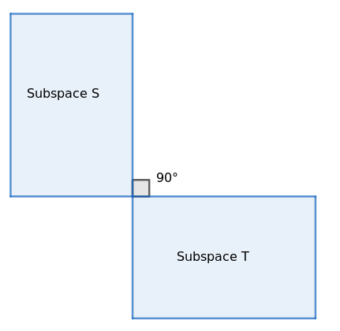
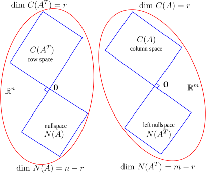
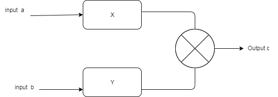

# Linear Algebra Lecture #14

<script type="text/javascript"
        src="http://cdn.mathjax.org/mathjax/latest/MathJax.js?config=TeX-AMS-MML_HTMLorMML"></script>
<script type="text/x-mathjax-config">
        MathJax.Hub.Config({ tex2jax: {inlineMath: [['$', '$']]}, messageStyle: "none" });
</script>

## This Chapter is about Orthogonality

- [Linear Algebra Lecture #14](#linear-algebra-lecture-14)
  - [This Chapter is about Orthogonality](#this-chapter-is-about-orthogonality)
    - [Orthogonality of vectors](#orthogonality-of-vectors)
  - [$$\mathbf {\vec{0}} \cdot \vec{X} = \mathbf{0}$$](#mathbf-vec0-cdot-vecx--mathbf0)
    - [Orthogonality of subspaces](#orthogonality-of-subspaces)
    - [Solving a sytem of Linear Euqation](#solving-a-sytem-of-linear-euqation)

---

### Orthogonality of vectors

Two vector  ```X,Y```  are said to be orthogonal on each other when their dot product result to zero.

$$ \vec{X} \cdot \vec{Y} = \mathbf{0}$$
$$ \vec{Y} \cdot \vec{X} = \mathbf{0}$$
$$ \mathbf{OR} $$
$$ \| \mathbf{X} \|^2 + \| \mathbf{Y} \|^2 = \| \mathbf{X} + \mathbf{Y} \|^2$$
The Same Dot product can be represent in terms of Linear algebra notation
$$ \vec{X} \cdot \vec{Y} \equiv \mathbf{X}^\top \mathbf{Y} = \mathbf{0}$$
$$ \vec{Y} \cdot \vec{X} \equiv \mathbf{Y}^\top \mathbf{X} = \mathbf{0}$$
From above defination we can say that Zero Vector is perpendicular with every vector.
$$\mathbf {\vec{0}} \cdot \vec{X} = \mathbf{0}$$
---

### Orthogonality of subspaces

Two Subspace ```S,T``` are said to be Orthogonal if every vector of subspace ```S```
is Orthogonal to every vector of subspace ```T```
<p align="center">
  
</p>

Row Space $\mathbf {C(\mathbf{A}^\top)}$ of  $\mathbf {A}$ is otrthogonal to the Null space,
let $\mathbf {X}$ $\in$ $\mathbf {N(A)}$ , so
$$\mathbf{A} \mathbf {X} = \vec{0}$$
$$ \begin{bmatrix} a_{11}&a_{12}&\cdots &a_{1n} \\
a_{21}&a_{22}&\cdots &a_{2n} \\
a_{31}&a_{32}&\cdots &a_{3n} \\
\vdots & \vdots & \ddots & \vdots\\
a_{m1}&a_{m2}&\cdots &a_{mn}
\end{bmatrix}
\begin{bmatrix}
x_1\\
x_2\\
x_3\\
\vdots\\
x_n
\end{bmatrix} =
\begin{bmatrix}
0\\
0\\
0\\
\vdots\\
0
\end{bmatrix}$$

$$ \begin{bmatrix} a_{11}&a_{12}&\cdots &a_{1n} \end{bmatrix} \begin{bmatrix}
x_1\\
x_2\\
x_3\\
\vdots\\
x_n
\end{bmatrix} = 0, \begin{bmatrix} a_{21}&a_{22}&\cdots &a_{2n} \end{bmatrix} \begin{bmatrix}
x_1\\
x_2\\
x_3\\
\vdots\\
x_n
\end{bmatrix} = 0, \cdots \begin{bmatrix} a_{m1}&a_{m2}&\cdots &a_{mn} \end{bmatrix}
\begin{bmatrix}
x_1\\
x_2\\
x_3\\
\vdots\\
x_n
\end{bmatrix} = 0 $$

$$ \mathbf{A_{row1}}^\top \mathbf{X} = 0, \mathbf{A_{row2}}^\top \mathbf{X} = 0, \cdots \mathbf{A_{rowm}}
^\top \mathbf{X} = 0 $$

So all m Row Vectors are orthogonal to $\mathbf {X}$ , where $\mathbf {X}$ $\in$ $\mathbf {N(A)}$ .

So all possible linear combination of m row Vectors will also orthogonal to $\mathbf {X}$.
Let $\mathbf {R}$ is a random Vector from $\mathbf{C(\mathbf{A}^\top)}$, $\mathbf {R}$ $\in$ $\mathbf{C(\mathbf{A}^\top)}$.
$$\mathbf {R} = \mathbf{C_{1}} \mathbf{A_{row1}} + \mathbf{C_{2}} \mathbf{A_{row2}}+ \cdots +\mathbf{C_{m}} \mathbf{A_{rowm}}, \ \textrm{  where } \ \mathbf{C_{1}}, \mathbf{C_{2}},\cdots, \mathbf{C_{m}} \in \mathbf{{\rm I\!R}} $$

if take dot product of $\mathbf{R}$ and $\mathbf{X}$, it will be zero. $\mathbf{R}^\top \mathbf{X} = \mathbf{0}$ , because Rows of A are orthogonal to X.

So Row Space $\mathbf {C(\mathbf{A}^\top)}$ is Orthogonal to Null Space $\mathbf {N(A)}$.

Dimention of Row Space $\mathbf{dim} [\mathbf{C(\mathbf{A}^\top)}] =\mathbf{r}$ and NullSpace $\mathbf{dim} [\mathbf{N(A)}] =\mathbf{n-r}$ , Where r is Rank of A.

So $\mathbf{dim} [\mathbf{C(\mathbf{A}^\top)}] + \mathbf{dim} [\mathbf{N(A)}] = \mathbf{n}$ , this two subspaces are complementery Orthogonal .

<p align="center">
  
</p>

Similarly it can be shown Coulmn Space $\mathbf{C(A)}$ is orthogonal to Left null space $\mathbf {N(\mathbf{A}^\top)}$.

---

### Solving a sytem of Linear Euqation

Consoider a system with two internal parareter, with two input port and single output port .
<p align="center">
  
</p>

system equation is governed by $\mathbf{a_{1}} \times \mathbf{x} + \mathbf{a_{2}} \times \mathbf{y} = \mathbf{c}$  where $\mathbf{a_{1}}$ and $\mathbf{a_{2}}$ are input and $\mathbf{x}$ and $\mathbf{y}$ are Systems internal parameter and $\mathbf{c}$ is output Variable.

we collected set of experiments data , inorder to estimate two internal parameter  $\mathbf{x}$ and $\mathbf{y}$ .
$$ \mathbf{a_{11}} \times \mathbf{x} + \mathbf{a_{12}} \times \mathbf{y} = \mathbf{c_{1}} \ \cdots (1)$$
$$ \mathbf{a_{21}} \times \mathbf{x} + \mathbf{a_{22}} \times \mathbf{y} = \mathbf{c_{2}} \ \cdots (2)$$
$$ \mathbf{a_{31}} \times \mathbf{x} + \mathbf{a_{32}} \times \mathbf{y} = \mathbf{c_{3}} \ \cdots (3)$$
$$ \vdots $$
$$ \mathbf{a_{m1}} \times \mathbf{x} + \mathbf{a_{m2}} \times \mathbf{y} = \mathbf{c_{m}} \ \cdots (m)$$

where $\mathbf{a_{i1}}$ and $\mathbf{a_{i2}}$ and is first and second input from i the measurement and $\mathbf{c_{i}}$ is output from i the measurement.

so we have m equation to solve two unknown . So

$$ \begin{bmatrix} a_{11}&a_{12}\\
a_{21}&a_{22}\\
a_{31}&a_{32}\\
\vdots& \vdots\\
a_{m1}&a_{m2}
\end{bmatrix}
\begin{bmatrix}
x\\
y\\
\end{bmatrix} =
\begin{bmatrix}
c_{1}\\
c_{2}\\
c_{3}\\
\vdots\\
c_{m}
\end{bmatrix}$$

$$\mathbf{A} \mathbf {X} = \mathbf{C}$$

where shape of $\mathbf{A}$ is m x 2 , Shape of $\mathbf {X}$ is 2 X 1 and Spape of $\mathbf {C}$ is m X 1.
This is not a solveable Linear System .

This section we try solve such a linear system where #number of equation >> #number of unknown

We will generalize the problem , Consider m is #number of equation and n is #number of unknown , and
$$\mathbf{m} >> \mathbf{n}$$
$$\mathbf{dim} [ \mathbf{A} ] = \mathbf{m} \times \mathbf{n} $$  
$$\mathbf{dim} [ \mathbf{X} ] = \mathbf{n} \times \mathbf{1} $$  
$$\mathbf{dim} [ \mathbf{C} ] = \mathbf{m} \times \mathbf{1} $$
so $\mathbf{A}$ is a rectangler matrix

fist we convert the matrix $\mathbf{A}$ to squre matrix by multiplying $\mathbf{A}^\top$
let  matrix $\mathbf{S} = \mathbf{A}^\top \mathbf{A}$ and $\mathbf{dim} [\mathbf{s}] = \mathbf{n} \times \mathbf{n}$

$$\mathbf{A}^\top\mathbf{A} \mathbf {X} = \mathbf{A}^\top\mathbf{C}$$
$$\mathbf{S} \mathbf {X} = \mathbf{A}^\top\mathbf{C}$$

so matrix $\mathbf{S}$ reactngular matrix nas Symmetric ,$\mathbf{S}^\top = \mathbf{[\mathbf{A}^\top \mathbf{A}]}^\top = [\mathbf{A}^\top] \mathbf{[\mathbf{\mathbf{A}}^\top]}^\top = \mathbf{A}^\top \mathbf{A} =  \mathbf{S}$

another prpperty $\mathbf{S}$ is it is having same rank as $\mathbf{A}$
$$\mathbf{rank}[\mathbf{S}] = \mathbf{rank}[\mathbf{A}] = \mathbf{r}$$
$$\mathbf{dim}[\mathbf{C(\mathbf{S}^\top)}] = \mathbf{dim}[\mathbf{C(\mathbf{A}^\top)}] = \mathbf{n - r}$$
